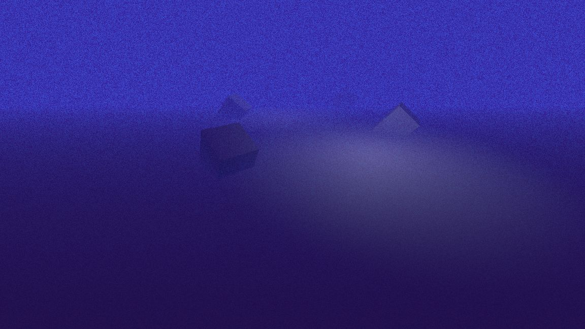

Screen Space Depth Fog

In Godot 4 volumetric fog replaced Godot 3 depth fog.
But depth fog feels more retro and is suitable for PSX / N64 style graphics.

This impliments the camera setup required to create a Post Processing with depth-sampling fragment shader in Godot 4 ala this guide: https://docs.godotengine.org/en/4.0/tutorials/shaders/advanced_postprocessing.html

It contains a scene with a 3D Camera Setup for with a Quad mesh stretched in front and uses a fragment shader to create a Distance/Depth based fog effect. The Fog also has a 2 color noise effect. The shader has input paramters to set the distance, colors and timescale of the noise. The second effect is a 2D Canvas shader that fades in from black, controlled by a script tweeen.

Tested in Compatability Render Mode Godot 4.0